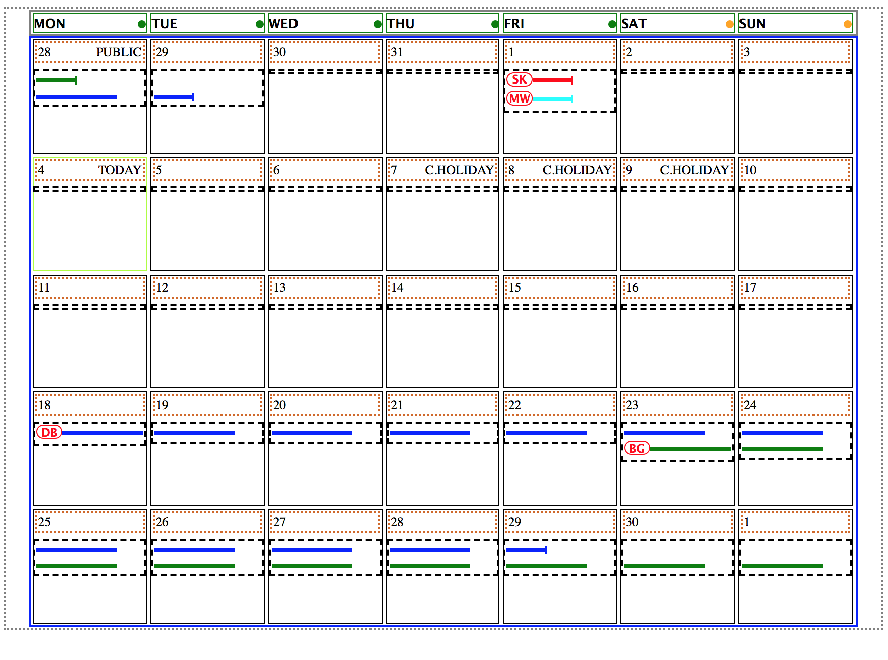

## Calendar layout app

## Instruction

***Copy/paste to command line***

- If you are on Mac click CMD + Space, type in Terminal and ENTER
- Copy & paste and ENTER to the terminal this sequence
- ```cd ~ && cd Desktop && git clone git@github.com:maciejk77/calendar-app.git && cd calendar-app && yarn install && git checkout app-prototype && yarn start```

### OR follow the same steps as above one by one
- Type in ```cd ~``` and than ```cd Desktop```
- Type in ``` git clone git@github.com:maciejk77/calendar-app.git```
- Type in ```cd calendar-app```
- Once download is complete do ```yarn install```
- Finally ```git checkout app-prototype```
- Now you can kickstart this with ```yarn start```
- *it should automatically open a page in browser, if not app is available at ```localhost:3000``` (url to put into browser if needed)

## Steps completed

My approach was based on a few assumptions:

- The app will receive some kind of structured data e.g. JSON object, which the mock of I have created to feed the rendering ***Calendar component***
- Grid of 7x5 was created by looping over that data set and using the individual ***CalendarItem*** component to style the given calendar day
- I have applied some logic to control e.g. whether that is weekday/weekend ```is_weekend: true``` and other like event for labels ***Today***, ***C.HOLIDAY***, ***Public***
- When provided CalendarItem rendered a ***BG***, ***MW*** etc. initials which have allocated colour to them
- When holiday finish on the day a flag ```continues: false``` is used, as oppose to line accross ```continues: true```
- React app with nested components, no Redux - props are passed from parent to child downwards
- App scaffolded with ***create-react-app***, used ***node-sass-chokidar*** and ***npm-run-all*** to transpile Sass to CSS
- used ***classnames*** npm package to control using custom classes depending on app logic e.g. change colour of dot next to the day name based on ```is_weekend: true ``` property, e.g.  ```<div className={cn('dot', {'dot--weekend': props.is_weekend })}></div>```

## To do
- Complete styling of the app, calendar items
- Move data from App.js to seperate file and import into
- Adding responsiveness, fixed width to 1024px at the moment
- Deploy to Heroku

## Screenshot (completed)


## Screenshot (first with borders, not completed)


## Requested final output as per below
